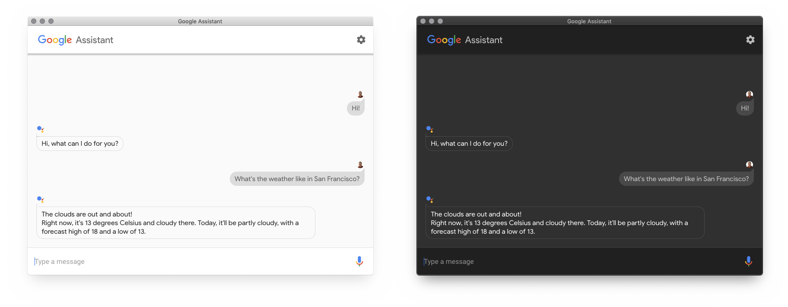

<h1 align="center">Google Assistant Desktop</h1>

  
  
  
  
  

A desktop version for the Google Assistant **(UNOFFICIAL)**.

## Features
These are the features that I intend to implement. The checked ones are the 
ones that have already been implemented:

- [x] Simple text messaging with the Assistant
- [ ] Audio communication with the Assistant
- [ ] Rich responses
- [ ] Continuous conversations
- [ ] Hotword detection (OK Google, Hey Google, custom hotwords)
- [ ] Assistant language switching
- [x] Dark theme
- [x] Automatic theme switching based on system theme
- [ ] Manual theme swtiching through settings
- [ ] MacBook Touch Bar integration (possibly replacing Siri)

_These are the currently planned features, but more might come later on. If you 
have an idea for a feature, open an issue so that it can eventually 
be added here._

## Contributing
Check out the [contributing guidelines](.github/CONTRIBUTING.md).

Note that if the bug concerns the communication with the Google Assistant, it 
might be related to [the library we use to communicate with it](https://github.com/Dabolus/nodejs-assistant) instead.

## License
MIT. You can read the full license text [here](LICENSE).
